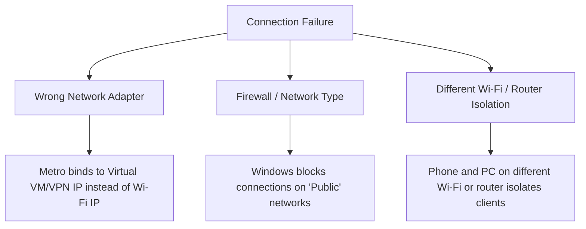

# 📱 Expo Go Connection & Troubleshooting Guide

This guide explains how to run your Expo project (`Dwellist`) and connect it to your mobile phone using **Expo Go**, even if you run into connection or QR code scanning errors.

---

## 🔍 Part 1: Why does the QR Code Fail? (The Quick Theory)

When you run `npm start`, Expo starts a local server (Metro Bundler) on your computer. To load the app, your phone needs to talk to this server. This connection can fail for three main reasons:



1. **Virtual Adapters (Most Common):** If you have VMware, VirtualBox, Docker, WSL, or VPNs installed, your PC has virtual network adapters. Expo might choose one of those virtual IPs (e.g. `192.168.227.1`) instead of your physical Wi-Fi IP (e.g. `10.84.168.210`). Your phone cannot reach a virtual IP.
2. **Windows Network Profile:** Windows blocks incoming traffic by default if your Wi-Fi is set to a **"Public"** profile instead of **"Private"**.
3. **Network Mismatch:** Your mobile phone and computer are not connected to the exact same Wi-Fi network, or your router has "AP Isolation" active.

---

## 🚀 Part 2: The Two Ways to Run the App

We have configured two easy commands in `package.json` to handle this.

### Option A: Tunnel Mode (Easiest & Most Reliable) ⭐️
Tunneling uses **ngrok** to create a public URL that routes traffic directly to your local computer. 
* **When to use:** If you are on a school/office/cafe Wi-Fi, using mobile data, or having firewall issues.
* **How to run:**
  ```bash
  npm run tunnel
  ```
* **How it works:** Metro generates a URL like `exp://u5-xyz.nh.expo.direct`. Your phone connects to this external URL, which redirects to your computer.

### Option B: LAN Mode (Fastest Performance)
LAN connects your phone directly to your computer's local IP.
* **When to use:** Home Wi-Fi where you want maximum reload speed and instant updates.
* **How to run:**
  ```bash
  npm start
  ```
* **If it binds to the wrong IP (e.g., VMware/VirtualBox):**
  You can force Expo to use your physical Wi-Fi IP address.
  1. Find your physical Wi-Fi IP using our diagnostic tool:
     ```bash
     npm run diagnose
     ```
  2. Start Expo forcing that IP address:
     * **Powershell:** `$env:REACT_NATIVE_PACKAGER_HOSTNAME="YOUR_WIFI_IP"; npm start`
     * **CMD:** `set REACT_NATIVE_PACKAGER_HOSTNAME=YOUR_WIFI_IP&& npm start`

---

## 🛠️ Part 3: Step-by-Step Connection Walkthrough

To share the app with a friend or test it yourself from scratch, follow these steps:

### Step 1: Install Expo Go
Download the official **Expo Go** app from the App Store (iOS) or Google Play Store (Android) on your mobile device.

### Step 2: Check Network Settings
* **Wi-Fi:** Ensure your phone and computer are on the same Wi-Fi network.
* **Windows Firewall:**
  1. Open Windows Settings ➔ **Network & Internet** ➔ **Wi-Fi**.
  2. Click on your connected Wi-Fi network.
  3. Change the Network Profile type to **Private**.
* **iOS Local Network Permission (iPhone only):**
  1. On your iPhone, go to **Settings** ➔ **Expo Go**.
  2. Verify that **Local Network** access is toggled **ON**.

### Step 3: Run the Server
In your terminal, choose your preferred method:
```bash
# Recommended for hassle-free connection
npm run tunnel
```

### Step 4: Scan and Open
* **Android:** Open the Expo Go app and tap **"Scan QR Code"**.
* **iOS (iPhone):** Open the default **Camera App** and scan the QR code. Tap the notification banner to open Expo Go.

---

## 📋 Summary of Commands

| Command | Purpose | When to Use |
| :--- | :--- | :--- |
| `npm run tunnel` | Runs the server using ngrok tunnel | **Recommended** - works everywhere, bypasses firewalls. |
| `npm start` | Runs the server on local LAN | Fast reloads, requires same Wi-Fi and Private network. |
| `npm run diagnose` | Diagnoses your network adapters | Run this to see what IPs are active on your computer. |
